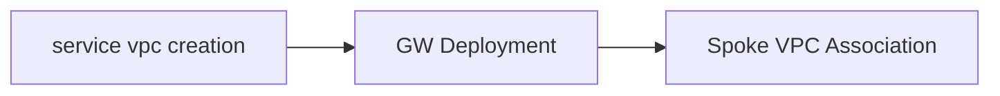

#  AWS Multicloud Defense Service VPC and GW Terraform

This repo utilizes Terraform modules to deploy both the Multicloud Defense Service VPC, and ingress/egress gateways within a single account. 

There a a few pre-requisites and steps that must be followed in order to get this setup working. Please follow the steps below.

Depending on the setup, some customers may choose to associate VPC's in the same account, or they can connect spokes that reside in different accounts. Depending on the configuration, the spoke VPC automation and Terraform configuration will differ. Please reference this for instructions on that terraform: https://registry.terraform.io/providers/CiscoDevNet/ciscomcd/latest/docs/resources/spoke_vpc
 > **Note:** Generate an API Key from Multicloud Defense UI under Administration --> API Keys. 
# Installation Steps

 1. Clone the repository
 2. Place your unedited multicloud defense API key in the root directory of the repo.
 3. Rename **sample_vars** to terraform.tfvars and modify your variables (change anything you want, however the following are the required ones to change):
	 - [ ] **VALTIX_API_KEY_FILE** --> The name of the key file you placed in step 2.
	 - [ ] **csp_account_name** --> Name of the AWS account as it appears in your Multicloud Defense UI
	 - [ ] **transit_gw_id** --> ID of the TGW you want to attach the service VPC too
	 - [ ] **aws_iam_role_firewall** -->This is the 'firewall' role that was created when Multicloud Defense onboarded the AWS account.
	 - [ ] **ssh_key_pair** --> name of the SSH key pair in the account that can be associated with the GW's 